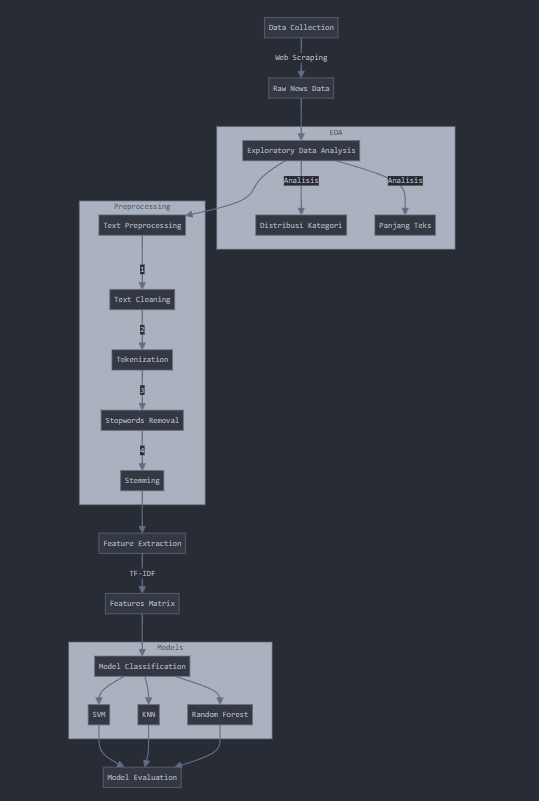

---

# Klasifikasi Berita Indonesia

## Tentang Project
Project ini bertujuan untuk mengembangkan sistem klasifikasi otomatis untuk berita berbahasa Indonesia ke dalam beberapa kategori seperti finance, teknologi, olahraga, otomotif, travel, makanan, kesehatan, pendidikan, dan properti menggunakan teknik machine learning KNN, SVM, dan Random Forest.

### Identitas Project
- **Nama Project**: Klasifikasi Berita Indonesia
- **Bahasa Pemrograman**: Python 3.10
- **Framework & Library**: scikit-learn, NLTK, Sastrawi
- **Dataset**: Kumpulan berita Indonesia dari detik

## Ringkasan Project

### Permasalahan
- Banyaknya berita online yang perlu dikategorikan secara manual
- Membutuhkan sistem otomatis untuk klasifikasi berita
- Perlunya pengolahan teks bahasa Indonesia yang tepat

### Tujuan
- Mengembangkan model klasifikasi berita otomatis
- Membandingkan performa berbagai algoritma machine learning
- Mencapai akurasi klasifikasi yang optimal

## Proses



- Scrapping berita dari Detik
- Proses EDA dan Features
- Analisis distribusi kategori
- Analisis panjang teks
- Text preprocessing (cleaning, tokenization, stopwords removal, stemming)
- Feature extraction menggunakan TF-IDF

## Cara Penggunaan
1. Unduh folder projek STKI_A11.2022.14428_UAS.
2. Ekstrak zip dan buka folder
3. Jalankan notebook `1_scraping_berita.ipynb` untuk klasifikasi.
4. Jalankan notebook `2_klasifikasi_berita.ipynb` untuk klasifikasi.

## Struktur Project
```
STKI_A11.2022.14428_UAS/
├── Model/
│   ├── knn_model.pkl
│   ├── rf_model.pkl
│   ├── svm_model.pkl
│   └── vectorizer.pkl
├── data/
│   └── berita.csv
├── 1_scraping_berita.ipynb
└── 2_klasifikasi_berita.ipynb
```
